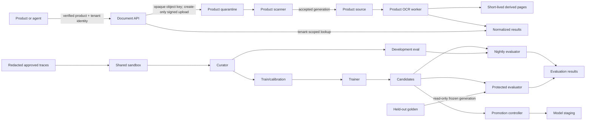

# Document Intelligence platform infrastructure

Status: proposed GitOps desired state for issues #914 and #916. Merging this
design does not approve an Atlantis apply, Argo CD sync, dataset copy, model
promotion, or production rollout.

## Scope and planning envelope

The platform is a reusable service. Products call its authenticated API or the
Australis tool with a verified product and tenant identity; agents never receive
bucket credentials. Kora is the first product runtime, while all evaluation and
training infrastructure is product-neutral.

Launch planning assumptions are 25 interactive requests/second, 100 batch
documents/minute, five pages/document on average, 300 pages and 100 MiB maximum
per document, and a 250 page/second burst. At 10,000 documents/day and 10 MiB of
source plus derivatives per document, 30-day runtime retention is roughly 3 TiB
before compression and deduplication. Capacity must be revisited at 2x sustained
traffic or 70% of a quota.

The API target is 99.9% monthly availability, p99 below 300 ms for durable job
acceptance, p95 below 8 seconds for a clean one-page result, and p95 below 60
seconds for a ten-page asynchronous result. Evaluation workloads have no
interactive latency SLO and must yield to production queues. CNPG recovery
targets are RPO <= 5 minutes and RTO <= 60 minutes; bucket version recovery is
tested quarterly before those targets are considered met.

## Trust and data flow

Document bytes, OCR text, signed URLs and model inputs are untrusted data. They
must never be placed in prompts as instructions, object names, logs, traces,
metrics, Kubernetes events or Terraform state. Object paths use opaque tenant,
document and version identifiers. Every read and mutation is scoped using the
verified identity, exact GCS generation and content digest.

## Isolation decision

Launch uses the existing `tesseracthub-480811` project and `asia-south1` region
to avoid a cross-project identity control plane and cross-region document
transfer. Shared-project isolation is acceptable only because every identity
has bucket-level object permissions, no identity has `storage.admin`, Kora and
shared data use different CMEK keys, and Kubernetes service accounts are
one-to-one with Google service accounts. A future Australian processing plane
gets separate buckets, keys, queues and workers; it must not read across regions.

Kora runtime buckets are quarantine, accepted source, two-day derived pages and
normalized results. The shared buckets are sandbox, candidates,
train/calibration, development evaluation, evaluation results, model staging
and held-out golden data. All are regional, versioned, force-destroy disabled,
uniform-access-only, public-access-prevention enforced, without CORS, and
CMEK-encrypted. GCP Data Access audit logs are the access record; raw object
payloads are never copied into observability systems.

The committed tests are deny proofs for the static IAM graph:

- Kora identities have no shared bucket binding.
- Shared identities have no Kora bucket binding.
- The trainer cannot read development-evaluation or golden objects.
- The protected evaluator can read but cannot mutate golden objects.
- Only the upload signer can sign as itself; no project-wide token creator is
  granted.
- The namespace has default-deny ingress and egress and exposes no public route.

These static proofs do not replace post-apply IAM Policy Troubleshooter tests
using Kora, a second product and every shared runner identity.

## Lifecycle and correctness

Quarantine expires after seven days, derived pages after two days, accepted
sources and results after 30 days, candidates after 30 days, and evaluation
results after 90 days. Curated train/calibration, development-evaluation,
model-staging and golden objects have no automatic deletion. Event-based and
temporary holds are required for legal hold and dataset freezes; lifecycle rules
cannot delete a held object. Tenant deletion is a durable workflow that records
the exact generations, deletes idempotently, verifies absence and retains only a
non-sensitive audit receipt.

An upload is accepted only after malware and MIME validation. The scanner copies
with source and destination generation preconditions, then records acceptance in
CNPG before quarantine cleanup. Workers checkpoint each page, so a failed page
does not replay a completed 300-page document. GCS is written create-only before
CNPG stores its immutable locator. Duplicate delivery returns the committed
result for the same idempotency key and input hash.

Dependency behavior is explicit:

- CNPG unavailable: reject new mutations; immutable result objects remain safe.
- GCS unavailable: keep the job retryable; never commit a locator to a missing
  object.
- Temporal unavailable: reject asynchronous starts; completed results remain
  readable.
- Valkey unavailable: bypass cache and rate-limit conservatively; it is never a
  source of truth.
- Qdrant unavailable: omit optional memory/retrieval; OCR and deterministic
  extraction continue.
- Provider/runtime unavailable: bounded jittered page retries, then page-level
  failure and review; never replay successful pages.
- Langfuse unavailable: processing continues through a bounded telemetry buffer
  without logging document content.

## Evaluation and promotion loop

Production traces contain identifiers, versions, timing, cost, tool outcomes and
redacted evaluation features—not raw documents or OCR text. Approved and legally
usable examples move from sandbox through redaction and review into immutable
dataset versions. Candidate engines are evaluated against development and
held-out golden versions with deterministic CER/WER, field F1, table accuracy,
schema, citation and policy checks plus calibrated model-based graders.

Every release pins engine, preprocessing, model, prompt, tool, policy, retrieval
and dataset versions. Promotion requires no critical safety regression,
structured output >= 99%, required-tool accuracy >= 98%, agreed document/language
accuracy thresholds, p95 within SLO and approved cost variance. The path is
sandbox -> offline evaluation -> shadow -> canary -> production. Production
traces are never automatically used for training.

## Delivery and rollback gates

Before Atlantis apply, reviewers must approve the bucket names, lifecycle,
CMEK, projected monthly storage/operation/egress spend, audit logging, legal-hold
procedure and IAM deny matrix. Empty regional buckets cost only stored bytes and
operations; the two dedicated software-protected KMS keys add approximately two
key-version monthly charges. A measured plan is the authoritative cost input.

Before Argo CD sync, the model/runtime, CNPG, Valkey and Qdrant review issues must
be approved; runner Deployments must add explicit egress, probes, requests,
memory limits, PDBs and queue-depth autoscaling. The current platform application
creates only the namespace guardrail and identities.

Rollback is a Git revert for Kubernetes resources. Storage rollback disables
writers and removes IAM grants but retains buckets, keys and objects; it never
destroys data automatically. Bucket/key removal is a separate reviewed deletion
with recreation capture, legal-hold verification and backup-expiry evidence.
