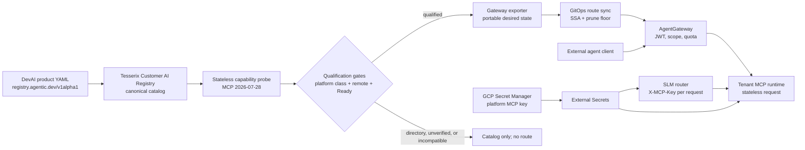

# MCP platform — registry-owned catalog, gateway-served tools

How an MCP server gets created, published, routed, versioned and consumed at
Tesserix, and how an agent obtains a token to call it.

The invariant: **the Tesserix Customer AI Registry is the only place an MCP
server is declared.** The gateway never holds hand-written MCP config; it
reconciles from the registry export. Nothing is `kubectl apply`-ed by a human.

This is the Tesserix-owned Registry using the canonical
`registry.agentic.dev/v1alpha1` API group. It is not the Solo.io registry.
`registry.solo.io/v1alpha1` is accepted only as a legacy input alias and is
normalized to the canonical API on ingest. The existing Solo AgentGateway is a
data-plane adapter; it does not own catalog state.

---

## 1. Current state

| Piece | Where | Role |
|---|---|---|
| Customer AI Registry | `agentregistry.agentregistry-system:12121`, `aregistry.tesserix.app` | Declares MCP servers and tools. Not on the request path. |
| MCP AgentGateway | `Gateway/agentgateway-mcp` in `agentgateway-system`, `mcp.tesserix.app` | Validates tokens, authorizes, rate-limits, proxies `/mcp/<server>`. |
| `agentgateway-route-sync` | CronJob, every 5 min | Exports configured tenant namespaces → SSA-applies `AgentgatewayBackend` + `HTTPRoute`. Prunes with a floor guard. |
| DevAI MCP Hub | `devai-mcp-hub.devai:8095` | Federates downstream MCP servers for DevAI agents; live `tools/list` every 60s. |
| DevAI MCP Bridge | `devai-mcp-bridge.devai:8099` | Fronts stdio/`npx` servers as streamable HTTP. |
| Seeds | `tesserix/devai` → `architecture/registry-seeds/mcp-servers/` | Git source of truth, POSTed by `devai-registry-bootstrap`. |

Identity is Zitadel: issuer `https://auth.tesserix.app`, project/audience
`387190457387450503`, MCP role `agentgateway.mcp`.

### 1.1 Control-plane and request flow



Catalog publication and request serving have separate failure domains. If the
Registry or route-sync is down, existing gateway routes continue serving. If a
probe fails, the declaration remains visible but cannot become a qualified
route. If AgentGateway is down, MCP calls fail closed; there is no direct path
that bypasses identity, policy, quota, or telemetry.

### 1.2 Historical defects addressed by this plan

**D1 — generated `/mcp/*` routes originally targeted nonexistent Services.**
The old `adapters/agentgateway.targetFor` fell back to
`<name>.<sandboxNamespace>.svc.cluster.local:8080/mcp` when a server had no
`spec.remotes[]`. The old seeds omitted `spec.remotes`, and
`agentgateway-sandbox` contained zero Services. Platform manifests now declare
the real endpoints and export rejects missing remotes:

```
homechef-mcp.homechef:8765      mark8ly-mcp.mark8ly:8765
stockpilot-mcp.stockpilot:8765  platform-mcp.support-platform:8765
```

Readiness now comes from the capability probe rather than the existence of a
Registry row.

**D2 — catalog entries were originally routed as if they were ours.**
The Hub skipped `spec.catalog: true` (`discovery.py`) because those are per-user
OAuth SaaS endpoints with no shared credential, but the old AgentGateway export
did not. Export now requires `mcp.tesserix.app/class: platform`; a directory
entry must never become a route.

**D3 — capabilities were declared but never observed.**
The Registry formerly resolved tools only from `spec.tools` +
`spec.toolSelector`. The stateless capability probe now observes `tools/list`,
writes status separately from spec, and prevents an unverified surface from
qualifying for a route.

---

## 2. Two classes of MCP server

Every `MCPServer` is exactly one of these. The class decides routing.

| | **Platform server** | **Directory entry** |
|---|---|---|
| Label | `mcp.tesserix.app/class: platform` | `mcp.tesserix.app/class: directory` (`spec.catalog: true`) |
| Examples | `homechef-mcp`, `platform-mcp`, `devai-mcp` | `catalog-github-mcp`, `catalog-slack-mcp` |
| Credential | Platform-owned, one for all callers | Per-user OAuth held by the end user |
| Exported to gateway | **Yes** — Backend + HTTPRoute | **No** — never routed |
| Reachable at | `https://mcp.tesserix.app/mcp/<tenant>/<server>` | The vendor's own endpoint, direct from the user's client |
| Purpose | Agents call it through the gateway | The UI lists it so a human can wire it into their own IDE |

The export adapter filters on this label. A directory entry appearing in
`kubectl get httproute -n agentgateway-system` is a bug.

### 2.1 Catalog trim

Removed (no platform use, per-user OAuth only): Airtable, Asana, Atlassian,
Box, Brave Search, Canva, ClickUp, Context7, Exa, Excalidraw, Fetch, Figma,
Filesystem, GDrive, GitLab, HubSpot, Intercom, Linear, Make, Notion, PayPal.

Kept as directory entries: Cloudflare, draw.io, GitHub, Google Workspace,
Grafana, Hugging Face, Kubernetes, MongoDB, Playwright, Postgres, Puppeteer,
Replit, Sentry, Slack, SQLite, Stripe, Supabase, Vercel, Zapier.

Deleting a seed file does not delete the registry row — the bootstrap Job only
POSTs. Removal is a separate, explicitly approved step (§6.2).

---

## 3. Access tokens

### 3.1 The model

One Zitadel machine client per agent workload per environment. No shared
tokens, no hand-made PATs, no reuse of `agentgateway-adk-prod`.

```
Zitadel client: agentgateway-<product>-<env>
GCP secrets:    <env>-<product>-agentgateway-client-id
                <env>-<product>-agentgateway-client-secret
Role:           agentgateway.mcp        (models need agentgateway.models)
```

Secrets reach the workload through External Secrets only. The runtime
exchanges them for a short-lived bearer at startup and on expiry:

```bash
curl --fail-with-body --user "${TESSERIX_MCP_CLIENT_ID}:${TESSERIX_MCP_CLIENT_SECRET}" \
  --data-urlencode grant_type=client_credentials \
  --data-urlencode "scope=openid urn:zitadel:iam:org:project:id:387190457387450503:aud urn:zitadel:iam:org:projects:roles" \
  https://auth.tesserix.app/oauth/v2/token
```

The gateway verifies issuer, audience, expiry, algorithm and role claim, then
proxies. Rate limits are keyed on the verified `sub`, so one client per agent
also means one quota and one blast radius per agent.

### 3.2 What the role does not give you

`agentgateway.mcp` is coarse — it grants *the MCP origin*, not a server or a
tool. Today the only thing narrowing a token to a specific server is the
caller's own allowlist, which is not an authorization boundary.

**Add per-server authorization** as an `AgentgatewayPolicy` generated by the
export: each server's route requires a scope `mcp:<tenant>:<server>`, granted
per client in Zitadel. A client onboarded for HomeChef then cannot reach
`platform-mcp` even though both sit behind the same role.

Tool-level control stays with the ADK allowlist plus `requires_approval`, which
is a product decision, not a gateway one.

### 3.3 Registry deploy keys are a different credential

Publishing to the registry uses a tenant-scoped deploy key
(`Authorization: Bearer agk_<tenant>_…`, stored as a SHA-256 digest). This is
deliberately separate from the runtime token: a leaked publish key must not be
able to call tools, and a leaked runtime client must not be able to change the
catalog. Never merge the two.

### 3.4 Router-to-runtime authentication

Every product MCP runtime requires `MCP_AUTH_KEY` and validates `X-MCP-Key` on
each independent request. The shared Helm chart derives the Kubernetes Secret
name as `<tenant>-mcp-auth`. External Secrets materializes that Secret from the
platform-owned GCP Secret Manager key
`prod-support-platform-<tenant>-mcp-key`; the SLM router consumes the same
remote value under `<TENANT>_MCP_KEY` and attaches it only to that tenant's
route.

These are platform service-to-service credentials, not customer or end-user
secrets. Customer-scoped credentials remain in OpenBao and must never be
placed in this Secret Manager flow. Missing MCP auth material fails closed: a
new runtime replica cannot start, and the router cannot authenticate a call.
NetworkPolicy and mesh identity remain defence in depth, not replacements for
per-request authentication.

---

## 4. Creating a new MCP server

Registry-first. Four inputs, one PR each, no manual gateway config.

### 4.1 Manifest

```yaml
apiVersion: registry.agentic.dev/v1alpha1
kind: MCPServer
metadata:
  name: <server>
  namespace: <tenant>
  tag: "1.2.0"                       # semver; the routed version
  visibility: internal
  labels:
    mcp.tesserix.app/class: platform
    owner: <team>
spec:
  name: <server>
  version: "1.2.0"
  description: One sentence, operator-owned.
  remotes:
    - type: streamableHttp
      url: http://<server>.<namespace>.svc.cluster.local:8765/mcp
  toolSelector:
    matchLabels:
      mcp.tesserix.app/server: <server>
```

`spec.remotes[]` is mandatory for a platform server — it is the only field the
export adapter reads for a target. The sandbox-Service fallback is what caused
D1 and is removed in §6.1.

### 4.2 Publish

```bash
agentic init MCPServer <server> > mcpserver.yaml
agentic apply -f mcpserver.yaml                      # local, against your own token
```

CI publishes with the product's deploy key to the one public write path:

```bash
curl --fail-with-body -X POST \
  -H "Authorization: Bearer ${AGENTIC_REGISTRY_DEPLOY_KEY}" \
  -H 'Content-Type: application/yaml' \
  --data-binary @mcpserver.yaml \
  https://aregistry.tesserix.app/v0/apply
```

### 4.3 Route appears by itself

Within 5 minutes `agentgateway-route-sync` exports the tenant namespace and
applies the Backend, HTTPRoute and per-server policy. Nobody edits
`tesserix-k8s` to add a server — only to onboard a *tenant* once.

### 4.4 Consume

```
https://mcp.tesserix.app/mcp/<tenant>/<server>
Authorization: Bearer <zitadel access token>
```

---

## 5. Capability and version sync

Today the gateway advertises whatever the manifest claimed. Close the loop with
a **capability prober** — a CronJob in `agentgateway-system` (or a goroutine in
route-sync) that, for each platform server:

1. Connects through the gateway with a platform service token.
2. Calls `server/discover` for MCP `2026-07-28`, then makes a self-contained
   `tools/list` request. Both requests carry matching `MCP-Protocol-Version`,
   `MCP-Method`, and `_meta` routing/capability metadata; neither uses
   `initialize`, `notifications/initialized`, or `Mcp-Session-Id`.
3. Rejects a server that does not advertise `2026-07-28`, then hashes the
   normalized tool set.
4. `PUT`s the observation to `status` on the registry object: `observedTools`, `observedHash`,
   `protocolVersion`, `lastProbedAt`, and a `Ready` condition.

That gives four things we do not have:

- **Reachability** — the UI's `ACTIVE` badge becomes true (`Ready=True` needs a
  successful probe, not a row in a table).
- **Drift detection** — `observedHash != declaredHash` raises a warning
  condition and an alert. A server that quietly grew a `delete_*` tool is
  visible.
- **Auto-versioning** — a changed capability hash proposes the next semver.
  Minor for added tools, major for removed or signature-changed tools. Proposal
  only; a human tags it.
- **Tool docs** — the registry can serve real tool schemas to the UI and to
  `agentic list tools`, instead of the declared list.

Probe results are status, never spec. The manifest stays the operator's
declaration; the probe stays the observation. They are compared, not merged.
The status handler rereads the current artifact and merges against its exact
tag, so an observation cannot be attached to a replacement published during a
probe run. A legacy-only response remains `Ready=False` and its tool list is not
published as a qualified observed surface.

### 5.1 Version pinning at the route

`metadata.tag` selects which revision the export renders. Routing
`/mcp/<tenant>/<server>` to the tag marked `latest`, and additionally exposing
`/mcp/<tenant>/<server>@<tag>` for pinned callers, lets an agent hold a version
across a publish. Rollback is retagging in the registry — no gateway change.

---

## 6. Plan

### 6.1 Phase 1 — make routes real (shipped)

| Change | Repo |
|---|---|
| Delete the sandbox-Service fallback in `targetFor`; a platform server without `spec.remotes[]` is an export error, not a guess | `agentic-registry` |
| Filter the agentgateway export on `mcp.tesserix.app/class=platform`; add a `labelSelector` query param as kagent's export already has | `agentic-registry` |
| Add `spec.remotes[]` with the real Service host and port `8765` to every platform seed; label all `catalog-*` as `directory` | `devai` |
| Validate on publish: `class=platform` requires `remotes[]`; reject at `/v0/apply` rather than at export | `agentic-registry` |

Exit criterion: `curl` through `mcp.tesserix.app/mcp/<tenant>/homechef-mcp`
returns a real `tools/list`, and no `catalog-*` HTTPRoute exists.

### 6.2 Phase 2 — clean the catalog (needs approval)

Seed files for the 21 are already removed. The registry rows and their live
routes are **not** — that is a deletion of production resources and needs a
separate go-ahead. Sequence, once approved:

1. `agentic delete mcpservers catalog-<name> <tag>` for each of the 21.
2. Route-sync prunes the corresponding HTTPRoutes within 5 minutes.
3. Verify the floor guard did not suppress the prune; confirm 30 routes remain.
4. Delete `sample-mcp` too — its own description says it is a fixture, safe to
   remove once verified.

### 6.3 Phase 3 — per-server authorization (shipped, enable in two steps)

The export renders an `AgentgatewayPolicy` per route requiring scope
`mcp:<tenant>:<server>`, read from the same Zitadel role claim the gateway's
JWT policy authorizes on. It is **off by default** — rendering the policies
before the roles exist would 403 every current client. Enablement order:

1. Grant `mcp:<tenant>:<server>` to each machine client in Zitadel.
2. Set `registry.requireServerScope=true` in `agentgateway-route-sync`.
3. Verify the deny case first: a HomeChef client gets 403 on `platform-mcp`.

Rolling back is step 2 in reverse; the roles can stay granted.

### 6.3.1 Credential brokering (shipped)

An MCP server declares `spec.credentialRef` — a Secret name, an optional key and
an optional header/prefix. The export turns it into an `AgentgatewayPolicy`
carrying `backend.auth.secretRef` on that server's own `AgentgatewayBackend`, so
the gateway injects the upstream API key and the agent only ever presents its
own identity token. The registry rejects credential material in a manifest at
publish time (`/v0/apply`) and again at export, so a literal key cannot reach
the catalog or the cluster. The Secret itself is GitOps-owned: platform
credentials via ESO from Secret Manager, tenant credentials via OpenBao.

### 6.4 Phase 4 — capability prober (shipped)

`cmd/agentic-probe` runs as a CronJob in `agentgateway-system`, authenticates
as an ordinary Zitadel machine client, and dials each server over the same
gateway path an agent uses — it derives those paths from the export adapter, so
probe and route cannot drift. It posts raw observations to
`PUT /v0/mcpservers/<name>/status`; the registry derives `Ready`, `Drifted` and
`Unreachable` from the declaration, so a compromised prober cannot assert
readiness for a server it never reached. Istio admits that principal to exactly
one write path and denies every other registry mutation. The UI badge is the
probe result — an unprobed server reads `Unprobed`, not `Active`.

Each probe operation is stateless MCP `2026-07-28`: `server/discover` followed
by a separately complete `tools/list`. The gateway may send those requests to
different replicas. Neither the probe nor a backend may depend on a session ID,
cookie affinity, or pod-local discovery state.

The CronJob is enabled with an immutable registry image carrying
`/app/agentic-probe`. It uses its dedicated mesh service-account identity on
the private MCP listener and therefore does not mount a broad OAuth client.
Public-listener JWT behavior remains covered by separate gateway smoke tests.

Outstanding: alert on `Unreachable` for any server with traffic in the last 24h.

### 6.5 Phase 5 — multi-tenant export (shipped)

`registry.sourceNamespaces` is a list; each namespace is a tenant, and a server
may also claim one with the `mcp.tesserix.app/tenant` label. Routes are served
at `/mcp/<tenant>/<server>` and, while `registry.legacyFlatPath` is true, also
at the pre-tenancy `/mcp/<server>` — dropped automatically where two tenants
claim the same server name. Onboarding a tenant is one line in values.

`agentgatewayRegistryNamespace` in `internal/api/agentgateway_admin.go` stays
single-namespace deliberately: it stores the platform's *own* security CRs
authored by administrators, not tenant content.

---

## 7. Scenarios

| Scenario | Handling |
|---|---|
| In-cluster server | `remotes[].url` → cluster Service. Backend targets it directly. |
| Remote streamable HTTP we own | `remotes[].url` → public host. Egress NetworkPolicy must allow it. |
| Third-party SaaS with per-user OAuth | Directory entry. Never routed; the user wires it into their own client. |
| stdio / `npx` server | Front it with `devai-mcp-bridge` (allowlist is `npx` only), publish the bridge URL as the remote. |
| Server deleted | Delete the registry row; route-sync prunes. Deleting the seed file alone does nothing. |
| Tool added upstream | Prober detects drift, proposes a minor version, human tags. |
| Breaking tool change | Prober flags major; publish a new tag; pinned callers stay on the old one until they move. |
| Credential rotation | Rotate in Zitadel + Secret Manager; ESO refreshes; restart or reload the workload. Registry and gateway are untouched. |
| Upstream API key for a routed server | `spec.credentialRef` names a Secret; the gateway injects it. A literal key in the manifest is rejected at publish. |
| Token revocation | Delete the Zitadel client. Existing tokens die at expiry — keep TTL short. |
| Registry outage | Existing routes keep serving. No new publishes, no route changes, no probes. |
| Gateway outage | MCP traffic stops. There is deliberately no direct fallback — that would bypass auth, policy, quota and telemetry. |
| Rate limiter outage | Fails closed. |

---

## 8. Verification

Every one of these must be part of the platform test suite, deny cases first:

1. Unauthenticated `/mcp/<tenant>/<server>` → 401.
2. Valid token, wrong role (`agentgateway.models` only) → 403.
3. Valid role, wrong per-server scope → 403.
4. Valid token and scope → `tools/list` returns the observed tool set.
5. A `class=directory` server has no HTTPRoute.
6. A `class=platform` server without `remotes[]` is rejected at publish.
7. Revoked deploy key → 401 at `/v0/apply`.
8. Deleted registry row → route gone within two sync intervals.
9. A manifest carrying credential material → rejected at `/v0/apply`.
10. A server the prober cannot reach → `Unreachable` in the catalog, and the UI
    never shows it as `Active`.
11. `server/discover` and `tools/list` carry matching `2026-07-28` header/body
    metadata; a legacy-only server cannot become Ready.
12. Requests carrying `Mcp-Session-Id`, GET event streams, or mismatched
    `MCP-Method` are rejected, and successive requests remain correct when they
    land on different replicas.

---

## 9. Deployment status (2026-09-03)

The runtime, Customer AI Registry, ADK, DevAI registrations, shared product
gateway, Scrapper integration, Stockpilot CLI, and Australis integration seam
are merged. Repository tests, Atlantis, and security checks for the GitOps
change pass, but production is not yet fully testable:

- GitOps PR `tesserix-k8s#869` still requires an independent review; branch
  protection must not be bypassed.
- The Registry and AgentGateway are ready in production.
- HomeChef, Mark8ly, and platform each retain one ready mutable-image replica,
  while the immutable `main-0bd8899` replica fails closed because
  `MCP_AUTH_KEY` was not injected.
- Dedicated Secret Manager keys exist for HomeChef, Mark8ly, Fanzone,
  Platform, Stockpilot, Gameverse, and Horoscope. Their values never belong in
  Git.
- Stockpilot MCP is configured for one replica so its stateless tool surface
  can be qualified and tested after reconciliation.
- No OpenPanel MCP implementation or authoritative manifest was found, so no
  server or Registry entry was fabricated. Scrapper has no active direct MCP
  workload and remains unverified and unrouted.

The auth wiring adds no workload or external-service cost: it reuses the
existing chart, router, Secret Manager, and External Secrets reconciliation.
Rollback is one Git revert of this wiring while the previous ready replicas
remain available; once the fail-closed runtime is the only deployed version,
rollback must select the last known-good Git/image revision through Argo CD.
